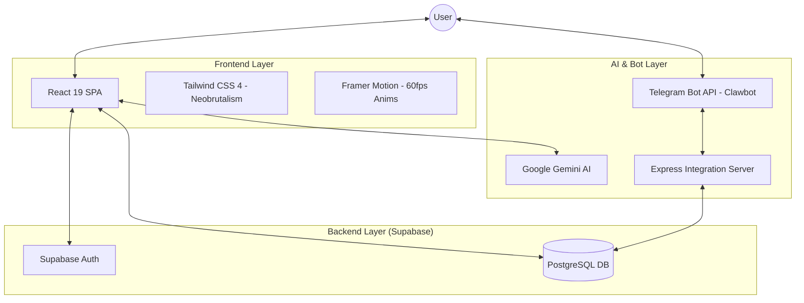

# ⚡ FINFLEX: Financial Revolution
### *Master Your Money, Flex Your Discipline.*

[](https://react.dev/)
[](https://vitejs.dev/)
[](https://tailwindcss.com/)
[](https://supabase.com/)
[](https://deepmind.google/technologies/gemini/)

---

</div>

**FinFlex** is a high-performance, AI-powered personal finance suite built for the provocateur. It strips away boring banking jargon and replaces it with raw power, visual clarity, and real-time financial insights.

## 🏗️ System Architecture

FinFlex leverages a modern, distributed architecture to provide real-time expense tracking across multiple platforms.



---

## 🚀 Key Features

### 📊 Tactical Dashboard
Real-time financial status, spending velocity, and income tracking.
- **Flex-O-Meter**: Dynamic tracking of your financial goals.
- **Transaction History**: Instant categorization of every rupee spent.

### 🤖 Clawbot (AI Agent)
Integrated financial intelligence via **Telegram**.
- **Log Expenses via Chat**: Send "50 for coffee" to the bot; it logs it to your dashboard instantly.
- **AI Financial Advice**: Get personalized insights powered by **Google Gemini**.

### 🛠️ Elite Toolset
A comprehensive suite of specialized financial calculators:
- **FIRE Calculator**: Plan your early retirement with high-precision projections.
- **Tax Estimator**: Dynamic calculation of annual tax liabilities.
- **EMI & Compound Interest**: High-fidelity wealth growth projections.
- **Punishment Contract**: A self-discipline engine for high-risk financial savers.

---

## 🛠️ Tech Stack

- **Core**: React 19, Vite 6, TypeScript 5.
- **UI Architecture**: Tailwind CSS 4, Framer Motion, Lucide Icons.
- **Data Persistence**: Supabase (PostgreSQL), Edge Functions.
- **Intelligence**: Google Gemini API, Custom Express Integration Server.
- **Mobile Access**: Telegram Bot API for remote expense logging.

---

## 🚦 Getting Started

### Prerequisites
- Node.js (v18+)
- Supabase Project
- Google AI Studio API Key
- Telegram Bot Token

### 1. Environment Configuration
Create a `.env` file in the root directory:

```env
VITE_SUPABASE_URL=your_supabase_url
VITE_SUPABASE_ANON_KEY=your_supabase_key
GEMINI_API_KEY=your_gemini_api_key
TELEGRAM_BOT_TOKEN=your_bot_token
```

### 2. Installation & Execution
```bash
# Install dependencies
npm install

# Run the project (Dev mode + Server)
npm run dev
```

---

## 📦 Deployment

The project is optimized for deployment on platforms like **Render**, **Vercel**, or **Netlify**.

```bash
# Build for production
npm run build

# Preview build
npm run preview
```

---

<div align="center">
  <p>Made with ❤️ in India for the Financial Revolution.</p>
  <p>© 2024 Finflex. No-line finance for the provocateur.</p>
</div>
